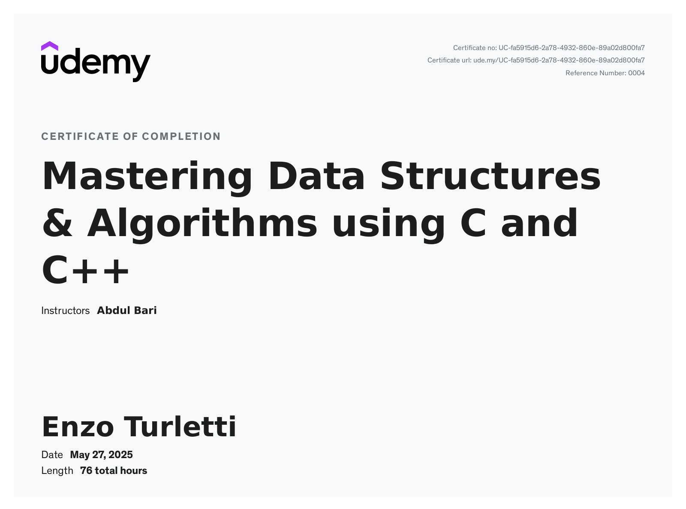

# Mastering Data Structures and Algorithms using C++

<p align="center">
  
</p>

## 📘 Description

This repository contains my implementations and exercises from the course **"Mastering Data Structures and Algorithms using C++"** by Abdul Bari.  
It covers a wide range of foundational and advanced topics in data structures and algorithms, including:

- Arrays
- Linked Lists
- Stacks & Queues
- Trees & Graphs
- Recursion
- Sorting & Searching
- Hashing

All code is written in **C++20** and organized by topic for easy reference and review.


## 📂 Table of Contents

- [📋 Requirements](#-requirements)
- [🚀 Run](#-run)
- [⚠️ Note](#-note)


## 📋 Requirements

To use all the features of this repository, ensure the following tools are installed on your system:

- **C++20 Compiler** (e.g., `g++`, `clang++`, or MSVC)
- **CMake** (version 3.10 or later)
- **[Conan](https://conan.io/)** (C++ package manager)


## 🚀 Run

To configure, build, and run the unit tests for the project, simply execute the following script from the root directory:

```bash
bash ./build.sh 
```


## ⚠️ Note

This repository is intended for learning and practice while following the course **"Mastering Data Structures and Algorithms using C++"**.  
Some implementations may take certain liberties or simplifications to focus on understanding underlying concepts.

Errors or incomplete parts may exist as part of the learning process.  
Your feedback, suggestions, and contributions are always welcome! Feel free to open issues or submit pull requests to help improve this work.

Thank you for helping make this learning journey better! 🙌