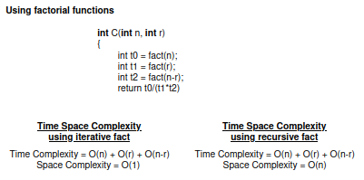
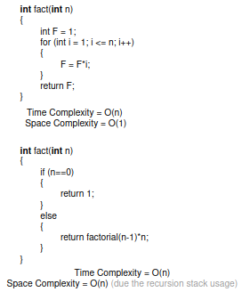
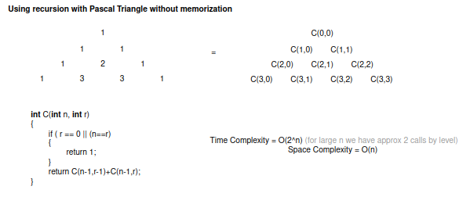
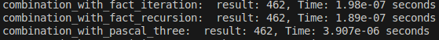

# **Combinatorial Analysis for \( C(n, r) \)**

This section benchmarks two different implementations of calculating combinations \( C(n, r) \):

1. **Using Factorials**
2. **Using Pascal's Triangle in a recursive way**

---

## **Description of Methods**

### **Using Factorials**

This implementation computes factorial values directly using an iterative or recursive approach.

    

    

- **Time Complexity**: \( O(n) + O(r) + O(n-r) = O(n) \), where \( O(n) \) accounts for the time to compute \( n! \), \( r! \), and \( (n-r)! \).
- **Space Complexity**:
  - \( O(1) \): For iterative factorial calculation.
  - \( O(n) \): For recursive factorial calculation due to stack usage.

**Advantages**:
- Simple to implement.
- Works well for small \( n, r \).

**Limitations**:
- Prone to integer overflow for large \( n \).
- Inefficient if called multiple times, as factorials are recomputed every time.

---

### **Using Pascal's Triangle (Recursive)**

This implementation uses Pascal's triangle recurrence relation:

    

- **Time Complexity**: \( O(2^n) \), as each recursive call splits into two more calls.
- **Space Complexity**: \( O(n) \), due to the recursion stack depth.

**Advantages**:
- Elegant and straightforward.
- Avoids factorial computation.

**Limitations**:
- Exponentially slow due to repeated subproblem calculations.
- Impractical for large \( n \).

---

## **Comparison**

| **Aspect**                | **Using Factorials**  | **Recursive Without Memoization** |
|----------------------------|-----------------------|------------------------------------|
| **Time Complexity**        | \( O(n) \)           | \( O(2^n) \)                      |
| **Space Complexity**       | \( O(n) \) or \( O(1) \) | \( O(n) \)                          |
| **Performance**            | Moderate             | Very slow                         |
| **Suitability for Large n**| Limited              | Poor                              |

---

## **Conclusion**

- For small values of \( n \), both methods are acceptable.
- For large values of \( n \), the factorial-based method is preferred due to better time efficiency.
- The recursive method without memoization becomes infeasible for large \( n \) due to exponential growth.

---

### **Sample Output**

For \( n = 11 \) and \( r = 5 \) :

    

---