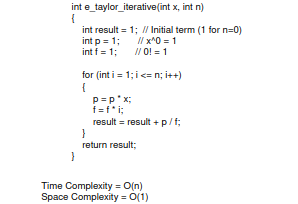

## **Taylor Series Analysis for \( e^x \)**

This section benchmarks two different implementations of calculating the Taylor series for \( e^x \):

1. **Recursive Method**: Uses recursion to calculate the Taylor series terms.
2. **Iterative Method**: Uses a loop to calculate the Taylor series terms.

---

## **Description of Methods**

### **Recursive Method**

The recursive function `e_taylor_recursive` calculates the Taylor series using a recursive approach. Static variables are used to store the intermediate values of \( x^i \) (power) and \( i! \) (factorial).

    

- **Time Complexity**: \( O(n) \), as the recursion depth equals the number of terms \( n \).
- **Space Complexity**: \( O(n) \), due to the recursion stack.
- **Advantages**: Straightforward implementation; useful for smaller \( n \).
- **Limitations**: Inefficient for large \( n \) due to stack usage and repeated computations.

---

### **Iterative Method**

The iterative function `e_taylor_iterative` calculates the Taylor series using a loop. Variables for \( x^i \) (power) and \( i! \) (factorial) are updated iteratively, eliminating the need for recursion.

    

- **Time Complexity**: \( O(n) \), as the loop iterates \( n \) times.
- **Space Complexity**: \( O(1) \), since no additional memory is used outside the loop.
- **Advantages**: More efficient than recursion; avoids stack overhead.
- **Limitations**: None significant; handles larger \( n \) more effectively.

---

## **Benchmarking**

The program benchmarks the recursive and iterative implementations of the Taylor series for \( e^x \) using the `<chrono>` library to measure execution time. Both implementations are tested for the same inputs.

---

### **Conclusion**

| **Aspect**              | **Recursive Method**  | **Iterative Method** |
|--------------------------|-----------------------|-----------------------|
| **Time Complexity**      | \( O(n) \)           | \( O(n) \)           |
| **Space Complexity**     | \( O(n) \)           | \( O(1) \)           |
| **Performance**          | Less efficient       | More efficient       |
| **Suitability for Large n** | Limited             | Excellent            |

- The **iterative method** is recommended for larger values of \( n \) due to its better space efficiency and comparable time performance.

### **EXTRA: Optimization to reduce the number of multiplications:**

    

---

### **Sample Output**

For \( x = 5 \) and \( n = 15 \) (15 terms in the series), the benchmarking output is similar to:

    

---