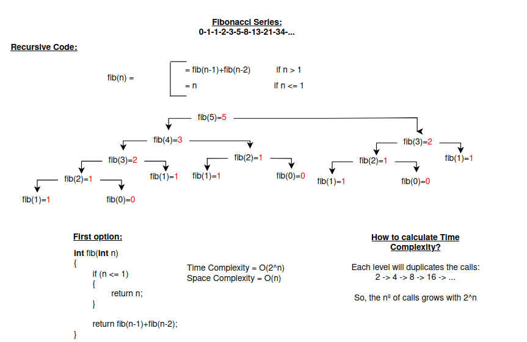
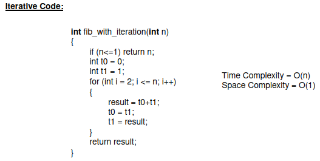
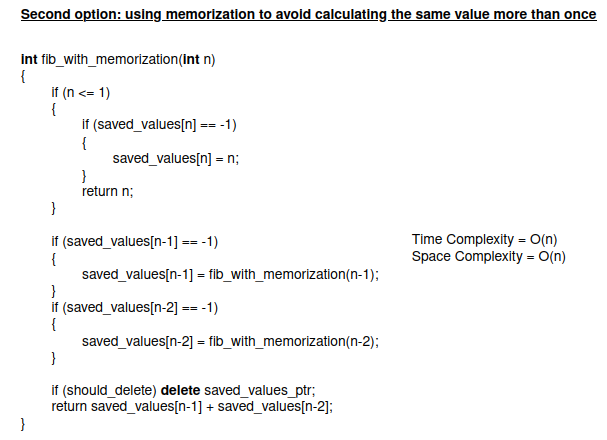
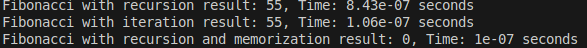

## **Fibonacci Series Analysis**

This section benchmarks two different implementations of calculating the Fibonacci series:

1. **Recursive Method**: Uses recursion to calculate Fibonacci numbers.
2. **Iterative Method**: Uses a loop to calculate Fibonacci numbers.
3. **Recursive with Memorization Method**: Uses recursion with memoization to optimize the Fibonacci calculation.

---

## **Description of Methods**

### **Recursive Method**

The recursive function `fib_with_recursion` calculates Fibonacci numbers using a direct recursive approach. Each Fibonacci number is calculated by recursively calling the function for \( n-1 \) and \( n-2 \).

    

- **Time Complexity**: \( O(2^n) \), as the recursion tree branches out exponentially.
- **Space Complexity**: \( O(n) \), due to the recursion stack.
- **Advantages**: Simple and intuitive approach for small inputs.
- **Limitations**: Inefficient for large \( n \) due to repeated calculations and high stack usage.

---

### **Iterative Method**

The iterative function `fib_with_iteration` calculates Fibonacci numbers using a loop. It iteratively computes the Fibonacci sequence starting from the base cases.

    

- **Time Complexity**: \( O(n) \), as the loop iterates through the Fibonacci sequence up to \( n \).
- **Space Complexity**: \( O(1) \), since only a few variables are used to store intermediate results.
- **Advantages**: More efficient than recursion; no stack overhead.
- **Limitations**: None significant; handles larger \( n \) efficiently.

---

### **Recursive with Memorization Method**

The `fib_with_recursion_memorization` function calculates Fibonacci numbers using recursion with memoization. It stores computed values to avoid redundant calculations, improving efficiency.

    

- **Time Complexity**: \( O(n) \), due to the use of memoization which prevents redundant calculations.
- **Space Complexity**: \( O(n) \), for the memoization storage.
- **Advantages**: Combines the simplicity of recursion with the efficiency of memoization.
- **Limitations**: Requires additional memory for the memoization structure.

---

## **Benchmarking**

The program benchmarks the recursive, iterative, and recursive with memorization implementations of the Fibonacci sequence using the `<chrono>` library to measure execution time. All implementations are tested for the same input \( n \).

---

### **Conclusion**

| **Aspect**              | **Recursive Method**  | **Iterative Method** | **Recursive with Memorization Method** |
|-------------------------|-----------------------|----------------------|---------------------------------------|
| **Time Complexity**      | \( O(2^n) \)           | \( O(n) \)           | \( O(n) \)                           |
| **Space Complexity**     | \( O(n) \)             | \( O(1) \)           | \( O(n) \)                           |
| **Performance**          | Less efficient        | More efficient       | More efficient                       |
| **Suitability for Large n** | Limited             | Excellent            | Excellent                            |

- The **iterative method** is recommended for larger values of \( n \) due to its better space efficiency and linear time performance.
- The **recursive with memorization method** is also highly efficient and a good balance between recursion and performance.

### **Sample Output**

For \( n = 10 \), the benchmarking output is similar to:

    

---