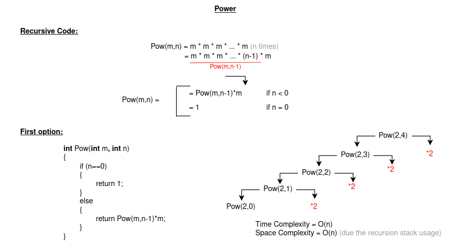

# Power Calculation Benchmark

This program benchmarks four different implementations of calculating \( m^n \) (m raised to the power of n):

1. **Recursive Method (Option 1)**: Uses basic recursion to calculate the power.
2. **Recursive Method (Option 2)**: Implements exponentiation by squaring for optimization.
3. **For-Loop Method (Option 1)**: Uses a simple `for` loop to calculate the power.
4. **For-Loop Method (Option 2)**: Implements exponentiation by squaring in a loop for optimization.

## Description of Methods

### Recursive Method (Option 1)
The recursive function `recursive_pow_option_1` calculates the power by repeatedly multiplying \( m \) until `n` reaches 0.

    

- **Time Complexity**: O(n), due to \( n \) recursive calls.
- **Space Complexity**: O(n), for the recursion stack.
- **Limitations**: Not optimized; inefficient for large values of `n`.

### Recursive Method (Option 2)
The recursive function `recursive_pow_option_2` optimizes the calculation using exponentiation by squaring. This method reduces the number of recursive calls by halving `n` at each step.

    

- **Time Complexity**: O(log n), due to the halving of `n` in each recursive call.
- **Space Complexity**: O(log n), due to the recursion stack.
- **Advantages**: Much faster than `Option 1` for large values of `n`.

### For-Loop Method (Option 1)
The function `for_pow_option_1` calculates the power using a simple loop. It iterates `n` times, multiplying the result by `m` in each iteration.

- **Time Complexity**: O(n), because the loop runs `n` times.
- **Space Complexity**: O(1), since no extra memory is used outside the loop.

    

### For-Loop Method (Option 2)
The function `for_pow_option_2` implements exponentiation by squaring in a loop. This reduces the number of operations by halving `n` at each step.

    

- **Time Complexity**: O(log n), due to the halving of `n` in each iteration.
- **Space Complexity**: O(1), as no additional space is used other than the loop variables.
- **Advantages**: Optimized for large `n`, much faster than `Option 1`.

## Benchmarking

The program uses the `<chrono>` library to measure the time taken by each method for a given input size. The benchmarking results are printed to the console for comparison.

### Sample Output
For a sufficiently large input (e.g., `n = 20`), the program produces output similar to the following:

    

