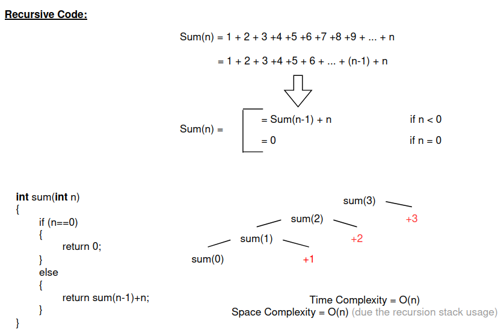
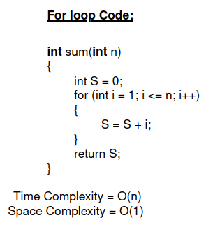
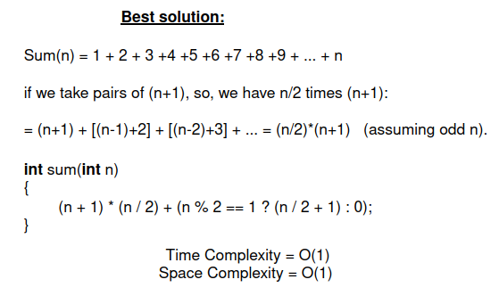
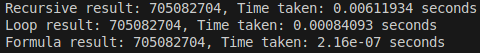

# Sum Calculation Benchmark

This program benchmarks three different implementations of summing the first `n` natural numbers: 

1. **Recursive Method**: Adds numbers recursively.
2. **Loop-Based Method**: Uses a `for` loop to calculate the sum iteratively.
3. **Direct Formula**: Uses the mathematical formula for the sum of the first `n` natural numbers.

## Description of Methods

### Recursive Method
The recursive function `sum_n_recursive` adds numbers by calling itself repeatedly until it reaches the base case. 

    

- **Time Complexity**: O(n) due to `n` recursive calls.
- **Space Complexity**: O(n) for the recursion stack.
- **Limitations**: May cause a stack overflow for large `n`.

### Loop-Based Method
The function `sum_n_with_loop` iterates through numbers from 1 to `n` and adds them sequentially.
- **Time Complexity**: O(n) due to the `for` loop.
- **Space Complexity**: O(1).

    

### Direct Formula
The function `sum_n` computes the sum using the formula:
\[ \text{Sum} = \frac{n \cdot (n + 1)}{2} \]
- **Time Complexity**: O(1).
- **Space Complexity**: O(1).
- **Correction**: Handles cases where `n` is odd to avoid truncation in integer division.

    

## Benchmarking

The program uses the `<chrono>` library to measure the time taken by each method for a given input size. The benchmarking results are printed to the console.

### Sample Output
For a sufficiently large input (e.g., `n = 100000`), the program produces output similar to the following:

    

